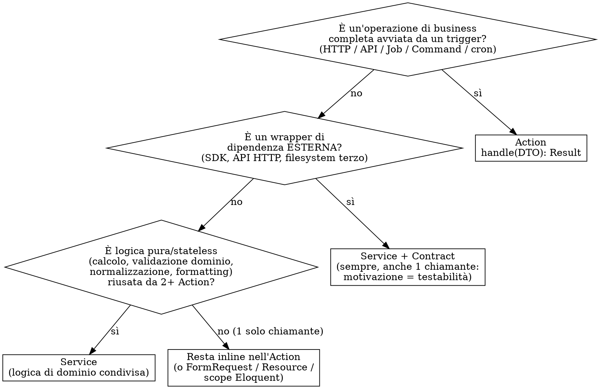

# Laravel: Action vs Service

## Principio

**L'Action è l'operazione di business. Il Service è un pezzo di logica pura, stateless, riusabile — oppure un wrapper di dipendenza esterna.**

La logica di orchestrazione di un'operazione vive *nell'Action*, non in un Service dedicato. Il Service esiste solo quando c'è riuso reale (2+ chiamanti) o quando va incapsulata una dipendenza esterna per testabilità. Niente strati per ipotesi future.

Questo modello è quello dominante nella community Laravel (Spatie, Lorisleiva, Nuno Maduro): *fat action, service riusabile*. Non è il "default core" del framework — Laravel core non ha né Action né Service layer — ma è la convenzione di riferimento per progetti strutturati.

## L'Action come entry-point uniforme

Un'Action è **context-free**: lo stesso codice viene invocato da HTTP, console, Job o scheduler senza cambiare. Il chiamante prepara un DTO tipizzato, invoca `handle()`, riceve un risultato tipizzato.

```php
namespace App\Contracts;

/**
 * Contratto comune per tutte le Action.
 *
 * I generics vivono solo in PHPDoc: PHP non ha generics a runtime,
 * la type-safety la fornisce PHPStan/Psalm a livello alto.
 *
 * @template TInput
 * @template TOutput
 */
interface Action
{
    /**
     * @param TInput $input
     * @return TOutput
     */
    public function handle(mixed $input): mixed;
}
```

Ogni Action dichiara i tipi concreti nel proprio docblock:

```php
namespace App\Actions\Users;

/**
 * @implements Action<RegisterUserData, User>
 */
final class RegisterUser implements Action
{
    public function __construct(
        private readonly SubscriptionService $subscriptions,
    ) {}

    public function handle(mixed $input): User
    {
        return DB::transaction(function () use ($input) {
            $user = User::create([
                'name'  => $input->name,
                'email' => $input->email,
            ]);
            $user->assignRole('customer');

            // logica di orchestrazione: sta QUI, non in un Service
            $this->subscriptions->startTrial($user);

            event(new UserRegistered($user)); // side-effect opzionale → Listener queued
            return $user;
        });
    }
}
```

**Perché `handle()` e non `__invoke()`:** `handle()` è la convenzione del core Laravel per un'unità di lavoro (Job, Command, Listener, Notification). Con un'interfaccia comune tipizzata è più leggibile per l'analisi statica e abilita un eventuale action bus generico. `__invoke()` resta la convenzione degli invokable controller, non delle Action.

## Decisione: dove metto questa logica?



## Quick Reference

| Tipo | Quando | Forma | Riuso |
|---|---|---|---|
| **Action** | Operazione di business completa invocabile da Controller/Job/Command/scheduler. Contiene l'orchestrazione. È il default. | `class Xxx implements Action { public function handle(TInput): TOutput }` | Bassa: 1 Action = 1 operazione |
| **Service (dominio)** | Logica **pura, stateless, riusata da 2+ Action** — calcoli, regole di dominio, validazioni, normalizzazioni, formatting | Classe con metodi pubblici stateless, dietro Contract iniettabile | Media-alta |
| **Service (wrapper)** | Wrapper di **dipendenza esterna** — SDK, API HTTP, filesystem/queue di terzi — **sempre**, anche con 1 solo chiamante | Classe che implementa un Contract, iniettata nelle Action | Bassa OK: motivazione = testabilità, non riuso |

## Regole non negoziabili

1. **Action = operazione, non contenitore vuoto.** L'orchestrazione (crea record, assegna ruoli, coordina più Service, gestisce la transazione, emette eventi) vive nell'Action. Non spostarla in un Service "di orchestrazione" — quello è l'anti-pattern service anemico.
2. **Action ha `handle()`** definito dall'interfaccia `Action<TInput, TOutput>`. Mai `execute()`, `run()`, o `__invoke()`. Una classe = una operazione = un metodo pubblico.
3. **Service = stateless.** Nessuna proprietà mutabile tra chiamate. Se serve stato, è un'Action o un Job.
4. **Service sempre dietro un Contract** (interface in `App\Contracts\...`) bindato nel `ServiceProvider`. Le Action iniettano l'interface, non la classe concreta.
5. **Controller sottile**: `FormRequest` → `DTO` → `$action->handle($dto)` → `Resource`. Niente Eloquent diretto nel Controller, niente chiamate a SDK, niente logica dopo l'invocazione dell'Action che non sia mapping di response.
6. **Side-effects opzionali** (email, analytics, webhook) → `Event` + `Listener` queued. Non sincroni dentro l'Action. Se Segment è down, la registrazione non fallisce.
7. **DTO tipizzato** (`spatie/laravel-data` o readonly class) tra `FormRequest` e Action. Mai array sciolti.
8. **Niente Use Case.** I workflow complessi sono Action che orchestrano più Service e/o sub-Action. Nessuno strato intermedio dedicato.

## Decision rules con esempi

### → Action

> "Registra un utente", "Pubblica un post", "Annulla un ordine", "Checkout completo", "Importa un CSV di anagrafiche"

Anche il workflow complesso resta un'Action: orchestra i passi, delega i calcoli ai Service, gestisce una sola transazione.

```php
/**
 * @implements Action<CheckoutData, Order>
 */
final class Checkout implements Action
{
    public function __construct(
        private readonly PricingService $pricing,   // logica pura riusata
        private readonly PaymentGateway $payments,   // wrapper SDK esterno
    ) {}

    public function handle(mixed $input): Order
    {
        return DB::transaction(function () use ($input) {
            $total = $this->pricing->calculate($input->cart, $input->coupon);
            $order = Order::create([...]);
            $this->payments->capture($order, $total);
            event(new OrderPlaced($order));
            return $order;
        });
    }
}
```

Nota: `Checkout` ha 3+ passi e branching potenziale, ma resta Action. Nel vecchio modello sarebbe stato un "Use Case" — non serve.

### → Service (wrapper esterno)

> Wrappa Stripe SDK, un client HTTP di terzi, un client S3 custom, un parser PDF.

Crea **sempre** Service + Contract, anche con 1 solo chiamante. La motivazione è testabilità e sostituibilità: mai chiamare un SDK esterno direttamente in un'Action.

```php
// App\Contracts\PaymentGateway  (interface)
// App\Services\Payments\StripeGateway  implements PaymentGateway
// binding nel ServiceProvider
```

### → Service (dominio)

> `PricingService::calculate()`, `TaxService`, un normalizzatore di indirizzi, un formatter di IBAN.

Crea Service **solo con 2+ chiamanti reali**. È logica pura, stateless, senza side-effect. Con un solo chiamante: la logica resta nell'Action (o in un metodo privato dell'Action).

### → Resta inline

Validazione `unique`, autorizzazione, query Eloquent semplici, format di response → vivono in `FormRequest`, `Policy`, scope Eloquent, `Resource`. Non serve un Service "per pulizia".

## Rationalizzazioni da rifiutare

| Tentazione | Verità |
|---|---|
| "Sposto tutta la logica dell'operazione in un Service, l'Action fa solo da passacarte" | No. Questo produce service anemici/passthrough. L'orchestrazione è il lavoro dell'Action. Il Service è per pezzi *puri e riusati*, non per l'intera operazione. |
| "Estraggo subito un Service di dominio, magari servirà" | YAGNI. Logica nell'Action finché non hai 2+ chiamanti reali. |
| "Uso `execute()` / `__invoke()`, è più esplicito" | No. La convenzione è `handle()` dall'interfaccia `Action`. Esplicito = la classe ha un solo metodo pubblico. |
| "Faccio un Service stateful con proprietà" | No. Service = stateless, idempotente per chiamata. Serve stato → Action o Job. |
| "Chiamo l'SDK Stripe direttamente nell'Action" | No. SDK esterni sempre dietro Contract — testabilità + sostituibilità. |
| "Invio l'email sincrona dentro l'Action" | No, se è side-effect opzionale: Event + Listener queued. L'Action fallisce solo per ciò che è essenziale alla coerenza transazionale. |
| "Il workflow è complesso, creo un layer Use Case" | No. Resta Action che orchestra Service e sub-Action. Nessuno strato Use Case. |

## Red flags — fermati e ripensa

- Un **Service con un solo chiamante** che non wrappa una dipendenza esterna → non è un Service, la logica torna nell'Action.
- Un Service che **orchestra un'intera operazione** (crea record + coordina + emette eventi) → è un'Action mascherata. Le operazioni sono Action.
- Il Service ha **stato** (proprietà mutabili tra chiamate) → non è un Service.
- Il Controller ha **logica dopo `$action->handle(...)`** che non sia mapping di response → appartiene all'Action.
- L'Action chiama un'altra Action → composizione OK; ma se diventa una catena profonda di 3+ sub-Action, rivedi i confini.
- Stessa logica **duplicata in 2+ Action** → *ora* è il momento di estrarre un Service, non prima.
- Un'Action con **`handle()` > ~50 righe** → estrai metodi privati nominati, o una sotto-Action, o un Service di dominio se la logica è pura e riusabile.

## Layout file (convenzione)

```
app/
├── Contracts/
│   ├── Action.php                    # interfaccia generica comune
│   ├── PaymentGateway.php            # contract wrapper esterno
│   └── PricingService.php            # contract servizio di dominio
├── Actions/
│   ├── Users/
│   │   └── RegisterUser.php          # implements Action<RegisterUserData, User>
│   └── Orders/
│       └── Checkout.php              # implements Action<CheckoutData, Order>
├── Services/
│   ├── Payments/
│   │   └── StripeGateway.php         # implements PaymentGateway (wrapper)
│   └── Pricing/
│       └── DefaultPricingService.php # implements PricingService (dominio)
├── Data/                             # DTO tipizzati
│   ├── Users/
│   │   └── RegisterUserData.php
│   └── Orders/
│       └── CheckoutData.php
├── Events/
│   └── UserRegistered.php
└── Listeners/
    ├── SendWelcomeEmail.php          # ShouldQueue
    └── TrackUserRegistered.php       # ShouldQueue
```

## Checklist quando aggiungi un endpoint

1. `FormRequest` per validazione + autorizzazione
2. `DTO` (readonly) per i dati validati
3. Controller: `return new Resource($action->handle($dto))`
4. `Action` con `handle()` — orchestra l'operazione, gestisce la transazione, delega calcoli puri ai Service
5. `Service` (dietro Contract) solo per wrapper esterni o logica pura riusata da 2+ Action
6. `Event` + `Listener` queued per side-effects opzionali
7. `Resource` per la response
8. Test: feature test sull'endpoint + unit test sull'Action (con Service mockati via Contract)