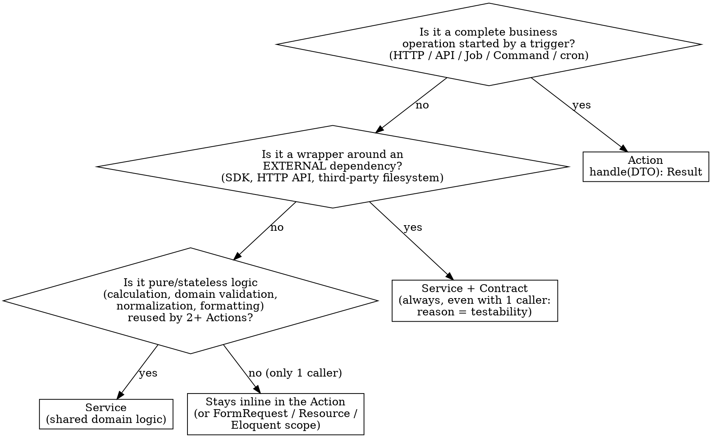

# Laravel: Action vs Service

## Principle

**The Action is the business operation. The Service is a piece of pure, stateless, reusable logic — or a wrapper around an external dependency.**

The orchestration logic of an operation lives *in the Action*, not in a dedicated Service. A Service exists only when there is real reuse (2+ callers) or when an external dependency must be encapsulated for testability. No layers for hypothetical future needs.

This model is the dominant one in the Laravel community (Spatie, Lorisleiva, Nuno Maduro): *fat action, reusable service*. It is not the framework's "core default" — Laravel core has neither an Action nor a Service layer — but it is the reference convention for structured projects.

## The Action as a uniform entry point

An Action is **context-free**: the same code is invoked from HTTP, console, Job or scheduler without changes. The caller prepares a typed DTO, invokes `handle()`, and receives a typed result.

```php
namespace App\Contracts;

/**
 * Common contract for all Actions.
 *
 * Generics live only in PHPDoc: PHP has no runtime generics,
 * type safety is provided by PHPStan/Psalm at a high level.
 *
 * @template TInput
 * @template TOutput
 */
interface Action
{
    /**
     * @param TInput $input
     * @return TOutput
     */
    public function handle(mixed $input): mixed;
}
```

Each Action declares its concrete types in its own docblock:

```php
namespace App\Actions\Users;

/**
 * @implements Action<RegisterUserData, User>
 */
final class RegisterUser implements Action
{
    public function __construct(
        private readonly SubscriptionService $subscriptions,
    ) {}

    public function handle(mixed $input): User
    {
        return DB::transaction(function () use ($input) {
            $user = User::create([
                'name'  => $input->name,
                'email' => $input->email,
            ]);
            $user->assignRole('customer');

            // orchestration logic: it lives HERE, not in a Service
            $this->subscriptions->startTrial($user);

            event(new UserRegistered($user)); // optional side-effect → queued Listener
            return $user;
        });
    }
}
```

**Why `handle()` and not `__invoke()`:** `handle()` is the Laravel core convention for a unit of work (Job, Command, Listener, Notification). With a common typed interface it is more readable for static analysis and enables an optional generic action bus. `__invoke()` remains the convention for invokable controllers, not for Actions.

## Decision: where do I put this logic?



## Quick Reference

| Type | When | Shape | Reuse |
|---|---|---|---|
| **Action** | Complete business operation invocable from Controller/Job/Command/scheduler. Contains the orchestration. It is the default. | `class Xxx implements Action { public function handle(TInput): TOutput }` | Low: 1 Action = 1 operation |
| **Service (domain)** | **Pure, stateless logic reused by 2+ Actions** — calculations, domain rules, validations, normalizations, formatting | Class with stateless public methods, behind an injectable Contract | Medium-high |
| **Service (wrapper)** | Wrapper around an **external dependency** — SDK, HTTP API, third-party filesystem/queue — **always**, even with only 1 caller | Class implementing a Contract, injected into the Actions | Low is OK: reason = testability, not reuse |

## Non-negotiable rules

1. **Action = operation, not an empty container.** The orchestration (creating records, assigning roles, coordinating multiple Services, managing the transaction, emitting events) lives in the Action. Do not move it into an "orchestration" Service — that is the anemic service anti-pattern.
2. **An Action has `handle()`**, defined by the `Action<TInput, TOutput>` interface. Never `execute()`, `run()`, or `__invoke()`. One class = one operation = one public method.
3. **Service = stateless.** No mutable properties between calls. If state is needed, it is an Action or a Job.
4. **A Service is always behind a Contract** (interface in `App\Contracts\...`) bound in the `ServiceProvider`. Actions inject the interface, not the concrete class.
5. **Thin Controller**: `FormRequest` → `DTO` → `$action->handle($dto)` → `Resource`. No direct Eloquent in the Controller, no SDK calls, no logic after the Action invocation other than response mapping.
6. **Optional side-effects** (email, analytics, webhooks) → queued `Event` + `Listener`. Not synchronous inside the Action. If Segment is down, registration does not fail.
7. **Typed DTO** (`spatie/laravel-data` or a readonly class) between `FormRequest` and Action. Never loose arrays.
8. **No Use Cases.** Complex workflows are Actions that orchestrate multiple Services and/or sub-Actions. No dedicated intermediate layer.

## Decision rules with examples

### → Action

> "Register a user", "Publish a post", "Cancel an order", "Full checkout", "Import a CSV of customer records"

Even a complex workflow stays an Action: it orchestrates the steps, delegates calculations to Services, and manages a single transaction.

```php
/**
 * @implements Action<CheckoutData, Order>
 */
final class Checkout implements Action
{
    public function __construct(
        private readonly PricingService $pricing,   // reused pure logic
        private readonly PaymentGateway $payments,   // external SDK wrapper
    ) {}

    public function handle(mixed $input): Order
    {
        return DB::transaction(function () use ($input) {
            $total = $this->pricing->calculate($input->cart, $input->coupon);
            $order = Order::create([...]);
            $this->payments->capture($order, $total);
            event(new OrderPlaced($order));
            return $order;
        });
    }
}
```

Note: `Checkout` has 3+ steps and potential branching, but it stays an Action. In the old model it would have been a "Use Case" — not needed.

### → Service (external wrapper)

> Wraps the Stripe SDK, a third-party HTTP client, a custom S3 client, a PDF parser.

**Always** create Service + Contract, even with only 1 caller. The reason is testability and replaceability: never call an external SDK directly in an Action.

```php
// App\Contracts\PaymentGateway  (interface)
// App\Services\Payments\StripeGateway  implements PaymentGateway
// binding in the ServiceProvider
```

### → Service (domain)

> `PricingService::calculate()`, `TaxService`, an address normalizer, an IBAN formatter.

Create a Service **only with 2+ real callers**. It is pure, stateless logic with no side-effects. With a single caller: the logic stays in the Action (or in a private method of the Action).

### → Stays inline

`unique` validation, authorization, simple Eloquent queries, response formatting → live in `FormRequest`, `Policy`, Eloquent scopes, `Resource`. There is no need for a Service "for tidiness".

## Rationalizations to reject

| Temptation | Reality |
|---|---|
| "I'll move all of the operation's logic into a Service, the Action just passes things along" | No. This produces anemic/passthrough services. Orchestration is the Action's job. The Service is for *pure and reused* pieces, not for the whole operation. |
| "I'll extract a domain Service right away, it might come in handy" | YAGNI. Logic stays in the Action until you have 2+ real callers. |
| "I'll use `execute()` / `__invoke()`, it's more explicit" | No. The convention is `handle()` from the `Action` interface. Explicit = the class has a single public method. |
| "I'll make a stateful Service with properties" | No. Service = stateless, idempotent per call. Need state → Action or Job. |
| "I'll call the Stripe SDK directly in the Action" | No. External SDKs always behind a Contract — testability + replaceability. |
| "I'll send the email synchronously inside the Action" | No, if it is an optional side-effect: queued Event + Listener. The Action fails only for what is essential to transactional consistency. |
| "The workflow is complex, I'll create a Use Case layer" | No. It stays an Action that orchestrates Services and sub-Actions. No Use Case layer. |

## Red flags — stop and rethink

- A **Service with a single caller** that does not wrap an external dependency → it is not a Service; the logic goes back into the Action.
- A Service that **orchestrates an entire operation** (creates records + coordinates + emits events) → it is a disguised Action. Operations are Actions.
- The Service has **state** (mutable properties between calls) → it is not a Service.
- The Controller has **logic after `$action->handle(...)`** other than response mapping → it belongs in the Action.
- An Action calls another Action → composition is OK; but if it becomes a deep chain of 3+ sub-Actions, revisit the boundaries.
- The same logic **duplicated in 2+ Actions** → *now* is the time to extract a Service, not before.
- An Action with **`handle()` > ~50 lines** → extract named private methods, or a sub-Action, or a domain Service if the logic is pure and reusable.

## File layout (convention)

```
app/
├── Contracts/
│   ├── Action.php                    # common generic interface
│   ├── PaymentGateway.php            # external wrapper contract
│   └── PricingService.php            # domain service contract
├── Actions/
│   ├── Users/
│   │   └── RegisterUser.php          # implements Action<RegisterUserData, User>
│   └── Orders/
│       └── Checkout.php              # implements Action<CheckoutData, Order>
├── Services/
│   ├── Payments/
│   │   └── StripeGateway.php         # implements PaymentGateway (wrapper)
│   └── Pricing/
│       └── DefaultPricingService.php # implements PricingService (domain)
├── Data/                             # typed DTOs
│   ├── Users/
│   │   └── RegisterUserData.php
│   └── Orders/
│       └── CheckoutData.php
├── Events/
│   └── UserRegistered.php
└── Listeners/
    ├── SendWelcomeEmail.php          # ShouldQueue
    └── TrackUserRegistered.php       # ShouldQueue
```

## Checklist when adding an endpoint

1. `FormRequest` for validation + authorization
2. `DTO` (readonly) for the validated data
3. Controller: `return new Resource($action->handle($dto))`
4. `Action` with `handle()` — orchestrates the operation, manages the transaction, delegates pure calculations to Services
5. `Service` (behind a Contract) only for external wrappers or pure logic reused by 2+ Actions
6. Queued `Event` + `Listener` for optional side-effects
7. `Resource` for the response
8. Tests: feature test on the endpoint + unit test on the Action (with Services mocked via Contract)
